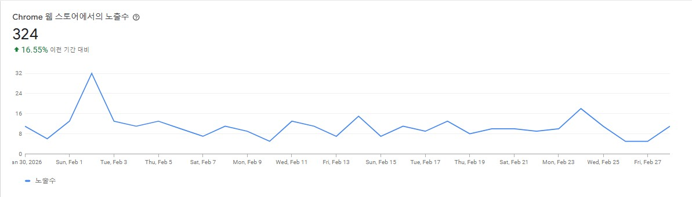

# YouTube Script Copy

유튜브 동영상의 자막을 클릭 한 번으로 클립보드에 복사하는 크롬 확장 프로그램입니다.

[](https://chromewebstore.google.com/detail/youtube-script-copy/lcidmmncffcblnglnmibkhjkloohkkeo)



## 주요 기능

- **두 가지 복사 모드**
  - Copy — 타임스탬프 포함 (예: `1:23 안녕하세요`)
  - Copy Text Only — 텍스트만
- **가상 스크롤 대응**: YouTube의 가상 스크롤 자막 패널에서 전체 자막을 수집합니다
- **백그라운드 프로세스 없음**: 클릭할 때만 동작하며, 별도의 백그라운드/콘텐츠 스크립트가 없습니다

## 설치

### Chrome 웹 스토어 (권장)

[Chrome 웹 스토어에서 설치](https://chromewebstore.google.com/detail/youtube-script-copy/lcidmmncffcblnglnmibkhjkloohkkeo)

### 직접 설치

1. 이 저장소를 클론합니다
   ```
   git clone https://github.com/junyjeon/youtube-script-copy.git
   ```
2. `chrome://extensions/`에서 개발자 모드를 활성화합니다
3. "압축해제된 확장 프로그램을 로드합니다"를 클릭하고 폴더를 선택합니다

## 사용 방법

1. 유튜브 동영상 페이지에서 확장 프로그램 아이콘을 클릭합니다
2. 원하는 모드를 선택합니다
   - **📋 Copy** — 타임스탬프와 함께 복사
   - **📄 Copy Text Only** — 텍스트만 복사
3. 붙여넣기 (Ctrl+V)

## 권한

| 권한 | 용도 |
|------|------|
| `activeTab` | 현재 탭의 YouTube 자막 접근 |
| `clipboardWrite` | 클립보드에 자막 저장 |
| `scripting` | YouTube 페이지에서 자막 추출 스크립트 실행 |

사용자 데이터를 수집하거나 외부로 전송하지 않습니다.

## 활용

- ChatGPT, Claude 등 LLM에 자막을 붙여넣어 요약/분석
- 강의, 회의 영상의 텍스트 기록 저장
- 외국어 영상 자막 번역

## 기여

이슈 등록이나 풀 리퀘스트를 통해 기여할 수 있습니다.

## 라이센스

MIT License
